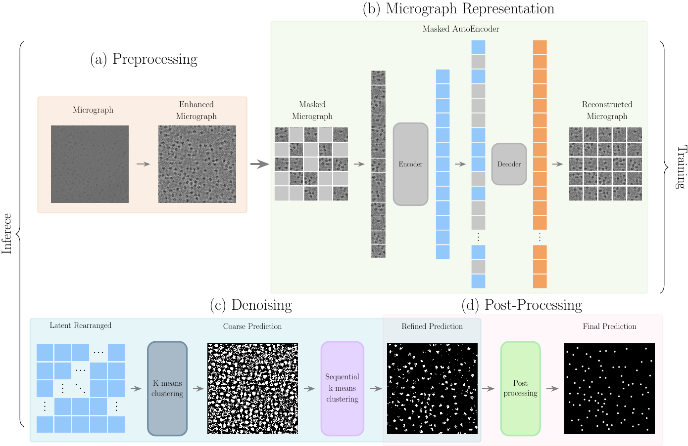

# Cryo-EMMAE : Self-Supervised particle picking in Cryo-EM imaging



The Cryo-EMMAE pipeline starts with an input micrograph and follows these steps:
a. **Pre-processing**: The micrograph undergoes normalization of background noise to minimize correlation with experimental parameters and is filtered to enhance particle contrast.
b. **Micrograph Representation**: Patches are extracted from the pre-processed micrograph and used to map it onto the MAE representation space.
c. **Denoising**: The resulting embeddings form a smaller image where a k-means trained on the train set identifies pixels with the lowest noise levels. These images undergo further denoising through micrograph-specific hierarchical clustering.
d. **Post-processing**: Convolution-based smoothing is applied on the predictions of the particle centres with greater accuracy.

## Table of Contents

- [Description](#description)
- [Installation (Linux)](#Installation-(Linux))
- [Usage](#usage)
- [License](#license)
- [Contributing](#contributing)
- [Contact](#contact)
- [Clarification](#clarification)
- [Citing this work](#citing-this-work)

<a id="description"></a>
## Description

Cryo-Electron Microscopy Masked AutoEncoder Cryo-EMMAE a self-supervised method designed to mitigate the need for such manually annotated data.
Cryo-EMMAE leverages the representation space of a masked autoencoder to sequentially denoise an input micrograph based on clusters of datapoints with different noise levels.
<a id="features"></a>

<a id="Installation-(Linux)"></a>
## Installation (Linux)

1\. Create the emmae environment by running the following commands in your terminal:

```bash
# create env
conda create -n emmae python=3.10
conda activate emmae

# pytorch
pip install torch==2.0.1 torchvision==0.15.2 torchaudio==2.0.2

# rest libraries
pip install huggingface-hub==0.23.3 scipy==1.11.4 opencv-python==4.10.0.82 scikit-learn==1.2.2 timm==1.0.3 tqdm==4.66.4 jupyter wandb==0.16.5
```

2\. Whenever you want to work on the project, activate the emmae environment by executing the following command in the terminal:

```bash
conda activate emmae
```
3\. Download from zenodo [https://doi.org/10.5281/zenodo.11659477](https://doi.org/10.5281/zenodo.11659477 ""), checkpoints of the models and the datasets used in this work.
Extract the files in the main directory of the project.

<a id="usage"></a>
## Usage

### Preprocess data
To preprocess your data (supporting image format and MRC format),
give micrograph image directory,
the particle diameter of your protein in pixels of the original micrograph shape,
and the output directory to save the preprocessed micrographs.

```bash
python preprocess.py --md 'input_directory_path' \
                     --t  'True if mrc file type, False if image file type, default is True' \
                     --pd 'particle diameter as integer,
                                          in pixel size of the original image, e.g. 224, default is 200' \
                     --od 'output_directory_path/' \
                     --id 'Give an identifier to your dataset'

#Example
python preprocess.py --md 'test/mrcs/' --od 'test/images/' --id 'test'
```

### Predict
Pick particles, given the yaml file, the experiment number, the according epoch for the checkpoint and the path to the list of the images to be predicted in npy format file.
This function also outputs the star file for the predicted coordinates at the directory "/results/star_files/".

```bash
python predict.py -c runs/example.yaml \
                  --ec  'Experiment checkpoint number to load' \
                  --e   'Number of epoch to load' \
                  --ip  'Provide the image path of your preprocessed mrc files.' \
                  --id  'Give the identifier of your dataset'

#Example
python predict.py -c 'runs/45.yaml' --ec '45' --e '500' --ip 'test/images/' --id 'test'
```

### Fine-tune on your dataset

```bash
python train.py -c runs/example.yaml \
                --input_dataset_path 'Provide the image path of your preprocessed mrc files.' \
                --load_model  'Epoch to load.' \
                --keep_checkpoint 'Keep checpoints every other epoch.' \
                --num_epochs 'Number of epochs to fine tune.'\
                --compute_kmeans 'Number of centers to compute the new kmeans for the latent representations.'


#Example
python train.py -c 'runs/45.yaml' --input_dataset_path 'test/images/' --load_model './checkpoints/45/MAE_epoch_500.pth.tar' --keep_checkpoints 10 --num_epochs 50 --compute_kmeans 4
```

### Train
To train the model prepare your yaml file from the given example.

```bash
python train.py -c runs/example.yaml
```

### Evaluate
Evaluate the picked particles based on the ground truth data, uploaded at the zenodo link under the results.zip file.
Give the same experiment, prediction-description, and prediction-set-path as in prediction step, the ground-truth-path is in default at "./results/target_512_20_npy/"

```bash
python evaluate.py  --path_of_pred 'path to directory of predictions' \
                    --ground_truth_path './results/target_512_20_npy/'

#Example
python evaluate.py --path_of_pred results/prediction_83_10077_npy_1024/ --ground_truth_path results/target_512_20_npy/
```

<a id="license"></a>
## License

This project is licensed under the MIT License - see the LICENSE file for details.

<a id="contributing"></a>
## Contributing

If you encounter any issues or have suggestions for improvement, please create an issue on GitHub. We appreciate your contribution!

<a id="contact"></a>
## Contact

For queries and suggestions, please contact: andreas.zamanos@athenarc.gr


<a id="Clarification"></a>
## Clarification of Experiment Numbers
45: trained with 20 EMPIARs 

82: trained with 10291

83: trained with 10077

84: trained with 10590

85: trained with 10816

All checkpoints from the above experiments are available [here](https://imisathena-my.sharepoint.com/:u:/g/personal/andreas_zamanos_athenarc_gr/EVEfngkl85FJp_KaL_JOGDABc0crog-V38E_ICI4VQJQEA?e=R9oPaw).

<a id="citing-this-work"></a>
## Citing this work

If you use this code in your research, please cite the original work.
